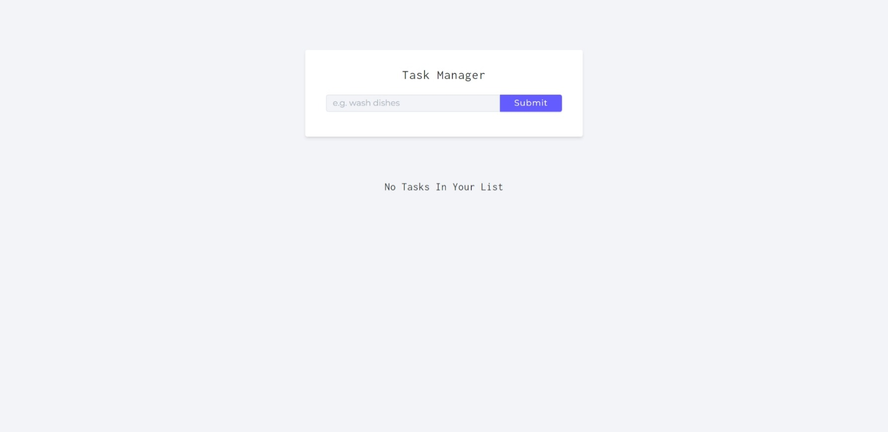
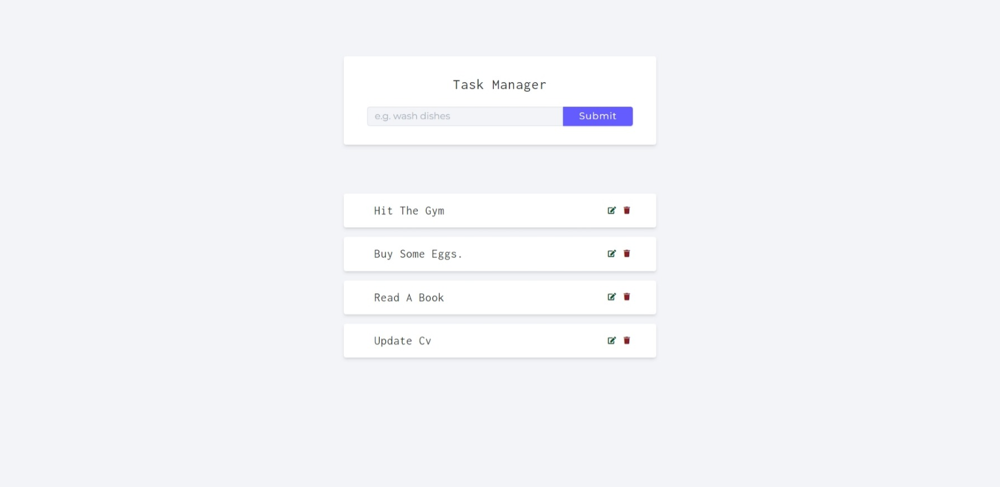
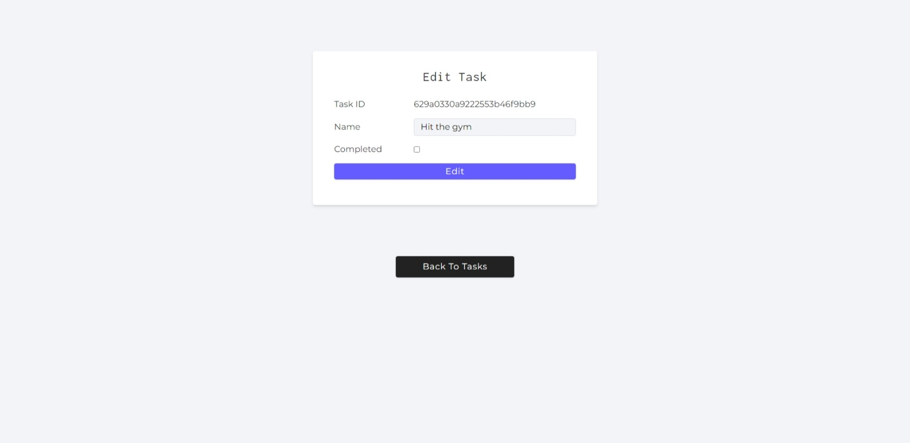
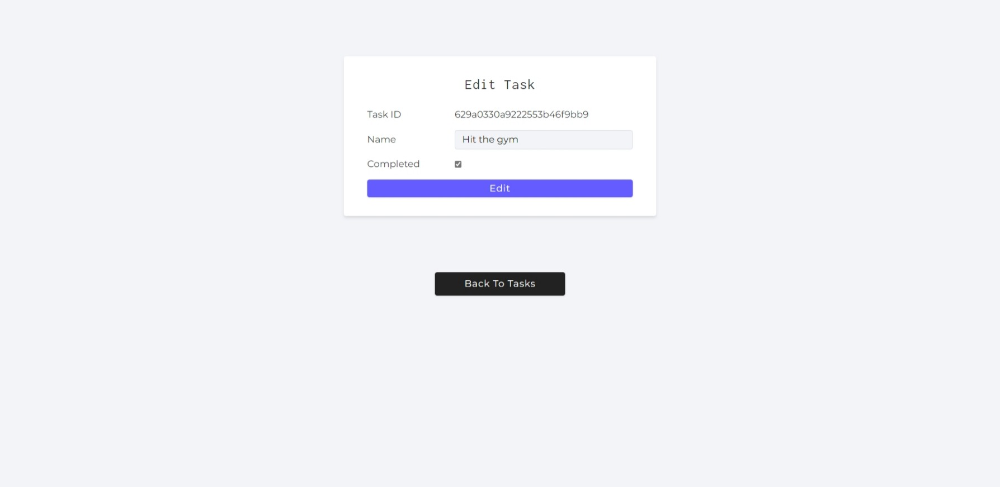

# Task Manager API using NODE JS
## Routes
- [x] `app.get('/api/v1/tasks')` - GET all the task.`
- [x] `app.post('/api/v1/tasks')` - CREATE a new task.`
- [x] `app.get('/api/v1/tasks/:id')` - GET single task.`
- [x] `app.patch('/api/v1/tasks/:id')` - UPDATE a task.`
- [x] `app.delete('/api/v1/tasks/:id')` - DELETE a task.

## Home Page

---

## Added Task

---

## Edit Task

---
## Complete Task

---
The front end of this project is from - [John Smilga](https://www.youtube.com/watch?v=rltfdjcXjmk&t=294s)